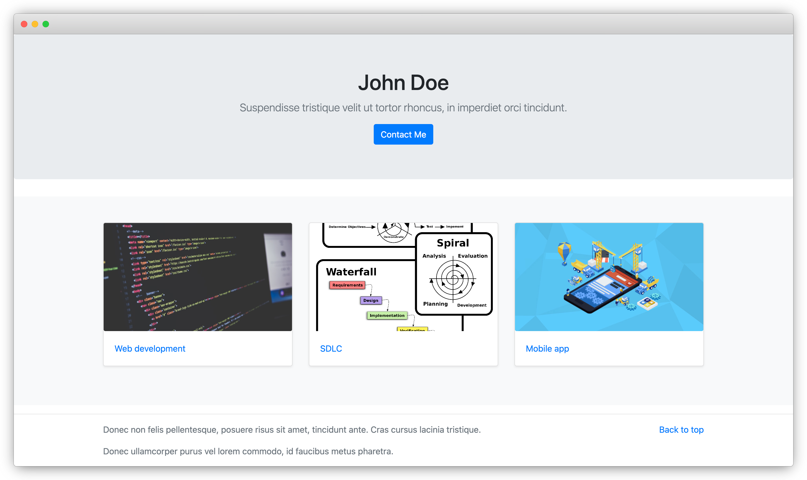
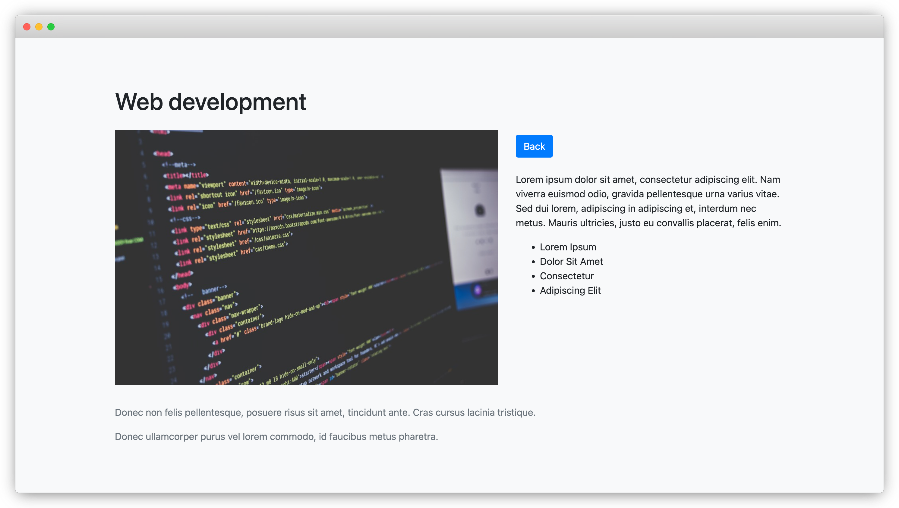

## Portfolio Website

> A simple portfolio website built with Django

### Table of Contents

- [Portfolio Website](#portfolio-website)
    - [Screenshots](#screenshots)
    - [Description](#description)
    - [Features](#features)
    - [Setup](#setup)
    - [License](#license)

### Screenshots

- Main Page

- Project Details

### Description

This is a simple portfolio website built with Django.
It is a responsive website that displays a list of projects and their details.
The website also has a contact form that allows users to send messages to the website owner.
The website is built with Django, Bootstrap, and other Django packages.

### Features

- Responsive design
- List of projects
- Project details
- Contact form
- Admin panel

### Setup

1. `git clone git@github.com:muhammadh-s/web-portfolio.git`
2. `cd web-portfolio`
3. `pip install -r requirements.txt`  
   _or place virtual environment and then install_
4. `python manage.py runserver`

### License

MIT
