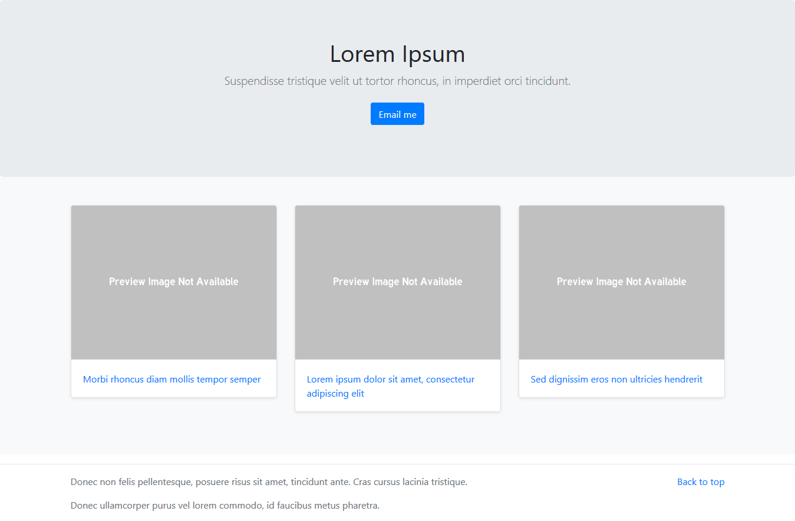

# Portfolio 
> A simple django website

#### Demo : https://web-portfolio-django.herokuapp.com

#### Built with (but not limited to):
- [Django](https://github.com/django/django)
- [PostgreSQL](hhttps://www.postgresql.org/)
- [Bootstrap](https://github.com/twbs/bootstrap)

## Setup

1. `git clone git@github.com:muhammadh-s/web-portfolio.git`
2. `cd web-portfolio`
3. `pip install -r requirements.txt`  
   _or place virtual environment and then install_
4. `python manage.py runserver`

## License
MIT

